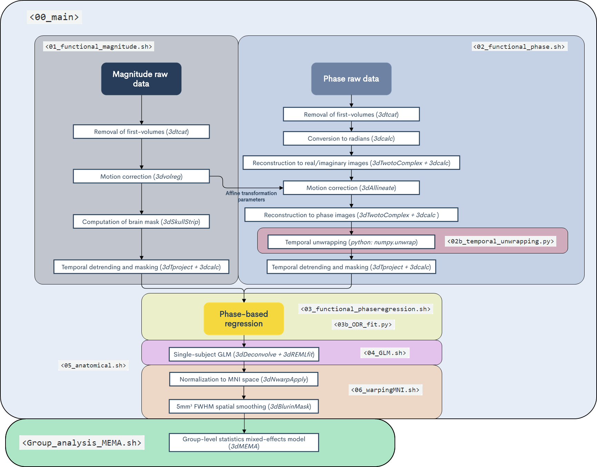

# Phase-based denoising pipeline

This repository contains the relevant scripts relative to the following study: [Paper-Link to be added]

The pipeline is organized as following:

* Both single-subject & group-level preprocessing and analysis are carried out by executing the script `<00_main.sh>` through the terminal, which runs the scripts in the corresponding order. The purpose of each script is briefly described below.

For implementation, one would need to change the environment variables for their own subject list, project directory, etc.. under `<00_main.sh>`. Similarly, there are other variables within each script that may need to be adapted to each case, like data file names (different for each study), onset time folder names, etc...  
_________________
* ***`<01_functional_magnitude.sh>`***: Functional preprocessing of magnitude images.  
* ***`<02_functional_phase.sh>`***: Functional preprocessing of phase images. Inside this script `<02b_temporal_unwrapping.py>` is also executed.  
* ***`<03_functional_phaseregression.sh>`***: Phase-based regression with two different fitting algorithms, i.e. with a least-squares approach and a orthogonal distance regression method (the latter is performed by the script `<03b_ODR_fit.py>`).  
* ***`<04a_functional_GLM.MEMA>`***: Computes the General linear model (GLM) separately for the tree types of preprocessed magnitudes (i.e. without any phase-based regression, OLS-denoised and ODR-denoised).  
* ***`<04b_functional_GLM_CompCor.MEMA>`***: Computes the General linear model (GLM) while including tCompCor regressors.  
* ***`<04c_functional_GLM_HighCor.MEMA>`***: Computes the General linear model (GLM) while including HighCor regressors.  
* ***`<05_anatomical.sh>`***: Calculates anatomical volumes and masks. This is not required by the pipeline, but it is convenient for visualization purposes.  
* ***`<06_warpingMNI.sh>`***: Transforms the results from the GLM's to the MNI space.  
* ***`<group_analysis_MEMA.sh>`***: Group-analysis through a mixed-effects model, which accounts for both within- and across- subject variability.  
* ***`<ROI_betas.sh>`***: Calculates average beta coefficient for each subject on predefined ROIs.  
_________________ OPTIONAL _______________
* ***`<vein_mapping.sh>`***: Generates a map of delineated veins for each subject, based on two methods  
__________________________________________

Below, we further illustrate a flow-chart of the pipeline showing the main steps that are performed within each script.  
 

 
